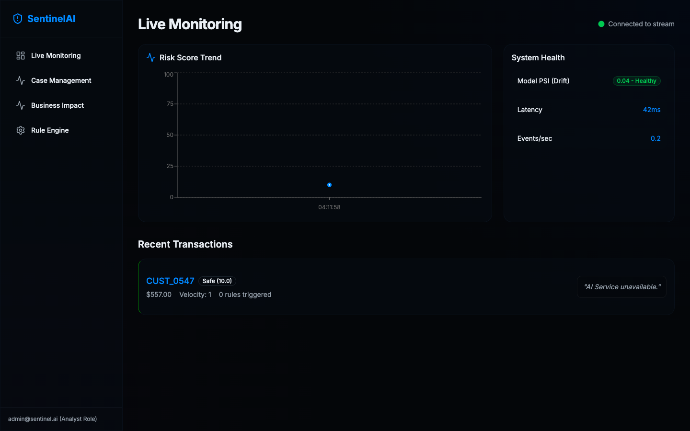
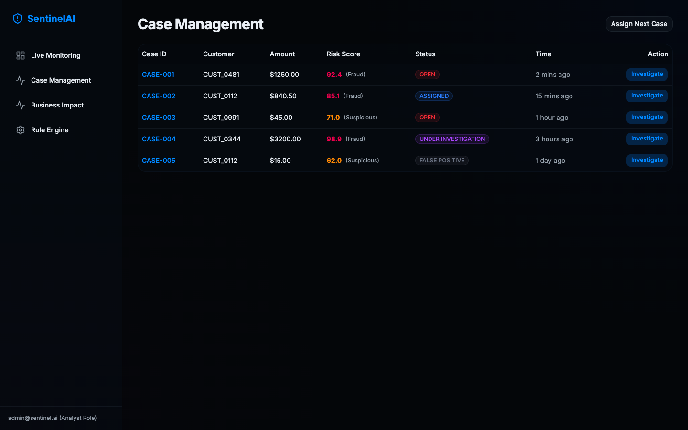
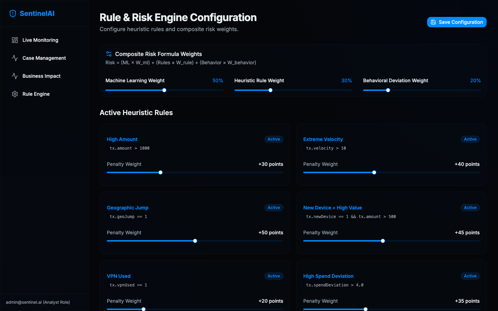
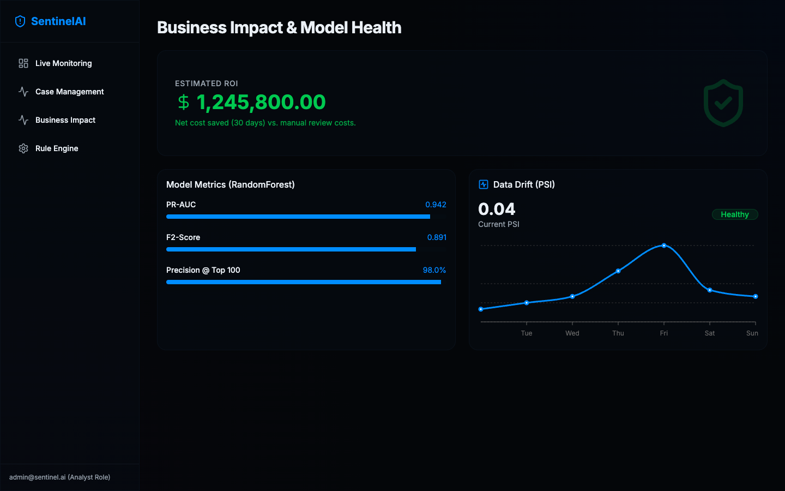
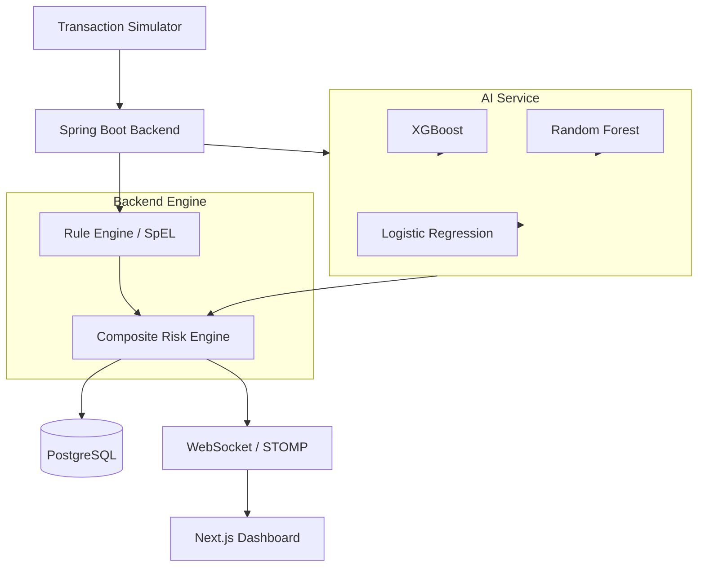

# SentinelAI

**Real-Time Fraud Detection with Hybrid Rules + Machine Learning**

SentinelAI is a high-performance, real-time fraud detection platform built to analyze financial transactions. By combining deterministic business heuristics with probabilistic machine learning models, SentinelAI provides a composite risk assessment with microsecond latency. The system streams evaluation results to an interactive live dashboard, offering both automated detection and human-readable feature explainability.


## Live Demo

🔥 **Live Dashboard:** [https://sentinel-dashboard-zv4v.onrender.com](https://sentinel-dashboard-zv4v.onrender.com)  
*(Note: As this is hosted on a free Render tier, the backend and AI services may take up to 50 seconds to spin up from sleep if inactive).*

## Screenshots

| Live Monitoring | Case Management |
| :---: | :---: |
|  |  |
| **Rule Engine** | **Business Impact** |
|  |  |

## Why SentinelAI?

Financial fraud cannot be stopped by static rules alone, but relying entirely on black-box machine learning can lead to unexplainable false positives. SentinelAI solves this by pairing the speed and determinism of a dynamic rule engine with the adaptability of an ensemble machine learning model. This hybrid approach ensures that obvious fraud is blocked instantly, while subtle, emerging fraud patterns are caught by the predictive AI layer.

## Key Features

- **Real-Time Transaction Processing**: Evaluates streaming mock transactions with low latency.
- **Rule-Based Fraud Detection**: Uses Spring Expression Language (SpEL) to run dynamic, on-the-fly heuristic rules without requiring a restart.
- **Machine Learning Fraud Prediction**: An ensemble of XGBoost, Random Forest, and Logistic Regression models calculate fraud probabilities.
- **Composite Risk Scoring**: Merges heuristic flags and ML predictions to output a final transaction risk band.
- **Explainability (Feature Influence)**: Provides feature-level explainability (using SHAP) so human analysts know *why* a transaction was flagged.
- **WebSocket Real-Time Updates**: Streams live transaction events and system health to the frontend via STOMP/SockJS.
- **PostgreSQL Persistence**: Reliably stores rules, transaction history, and prediction metadata.
- **ML Model Retraining**: Support for dynamic, on-the-fly retraining of the machine learning models via the FastAPI service.
- **Live Monitoring Dashboard**: A stunning Next.js interface for viewing risk trends, rules, and live cases.
- **Docker Compose Setup**: Completely containerized for a one-click local deployment.

## Architecture



## Detection Pipeline

SentinelAI does not rely solely on machine learning. The detection pipeline is built around three core pillars:

1. **Rule-Based Detection**: Incoming transactions hit a deterministic rules engine first. If a transaction violates a hard business rule (e.g., amount > $10,000 and location is high-risk), it is immediately flagged.
2. **Machine Learning Prediction**: Simultaneously, the transaction is passed to the AI microservice where an ensemble of predictive models evaluates subtle behavioral features (velocity, spending deviation).
3. **Composite Risk Evaluation**: The Composite Risk Engine receives the deterministic rule score and the probabilistic ML score, weighing them together to calculate the final risk band and decide the transaction's fate.

## Machine Learning Layer

The Python/FastAPI microservice handles the intelligent prediction layer using `scikit-learn` and `xgboost`. It loads pre-trained models to evaluate transaction features in real-time. The models include:
- **XGBoost**: For handling non-linear, high-dimensional tabular data.
- **Random Forest**: For robust, ensemble-based decision trees.
- **Logistic Regression**: For highly calibrated baseline probabilities.

## Tech Stack

- **Backend**: Java, Spring Boot, Spring Expression Language (SpEL), WebSocket, STOMP
- **AI Service**: Python, FastAPI, XGBoost, Scikit-Learn, SHAP, Pandas
- **Frontend**: Next.js, React, Tailwind CSS, SockJS, STOMP
- **Database**: PostgreSQL
- **Infrastructure**: Docker, Docker Compose

## Project Structure

```text
SentinelAI/
├── ai-service/          # Python, FastAPI, ML models, feature influence
├── backend/             # Java, Spring Boot, SpEL Rule Engine, WebSocket
├── frontend/            # Next.js, React, real-time dashboard
├── docker-compose.yml   # Multi-container orchestration
└── README.md            # You are here
```

## Getting Started

To run the entire platform locally:

1. **Clone the repository:**
   ```bash
   git clone https://github.com/MAYANK479/SentinelAI.git
   cd SentinelAI
   ```

2. **Start the containers:**
   ```bash
   docker compose up -d --build
   ```

Once the containers are successfully running, the services will be available at:

- **Frontend Dashboard:** [http://localhost:3000](http://localhost:3000)
- **Spring Boot Backend:** `http://localhost:8080`
- **AI Service (Swagger UI):** [http://localhost:8000/docs](http://localhost:8000/docs)

*Note: The `docker-compose.yml` file contains default local-only demo credentials for PostgreSQL. For a production deployment, ensure you configure proper environment variables and secrets.*

## API and Service Endpoints

**Live Deployed Endpoints (Render):**
- **Backend WebSocket**: `wss://sentinel-backend-d1qo.onrender.com/ws`

**Local Development Endpoints (Docker Compose):**
- **AI Service Prediction**: `POST http://localhost:8000/api/v1/predict`
- **AI Service Retraining**: `POST http://localhost:8000/api/v1/retrain`
- **Backend WebSocket Endpoint**: `ws://localhost:8080/ws`

## Explainability

A core engineering focus of SentinelAI is model explainability. Black-box models are unacceptable in regulated financial environments. The AI Service uses SHAP (SHapley Additive exPlanations) to calculate the marginal contribution of each feature to the final prediction. This data is bubbled up to the Next.js frontend, allowing human risk analysts to see exactly which features drove the fraud score.

## What I Built / Engineering Learnings

Building SentinelAI required integrating multiple languages and paradigms into a cohesive, low-latency system:
- **Real-Time Streaming**: Implemented STOMP over WebSockets to establish a continuous, bi-directional connection between the Java backend and Next.js frontend.
- **Dynamic Rules Evaluation**: Used Spring Expression Language (SpEL) to allow business users to define and update complex rules at runtime without redeploying the backend.
- **Microservice Communication**: Designed the backend to orchestrate synchronous REST calls to the FastAPI machine learning service while maintaining high throughput on simulated transaction streams.

## Roadmap

- Add Kafka for more robust, distributed message streaming.
- Implement more advanced deep learning techniques (e.g., Autoencoders for anomaly detection).
- Expand the frontend dashboard with historical reporting and graphing.

## Author

**Mayank Pandey**
[GitHub Profile](https://github.com/MAYANK479)
